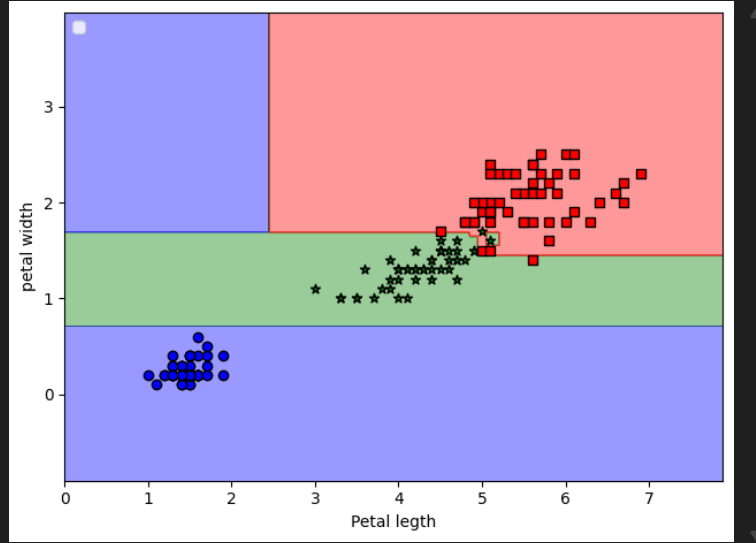

# Decision-Trees
tHE 1ST fILE has simple code for Decision trees

effects of entropy on different classes: 

# Different types of imputity

Visualizing different classes using decision tree: 

# Tree Logic

The root node starts with 105 examples at the top. The first split uses a sepal width cut-off ≤ 0.75 cm for splitting the root node into two child nodes with 35 examples (left child node) and 70 examples (right child node). After the first split, we can see that the left child node is already pure and only contains examples from the Iris-setosa class (Gini impurity = 0). The further splits on the right are then used to separate the examples from the Iris-versicolor and Iris-virginica class.

# Summary
First check: If sepal width ≤ 0.7 → probably Setosa
If not, check: If sepal width ≤ 1.55
If yes → go to step 3
If no → Virginica 
Check sepal length:
If ≤ 4.95 →  Versicolor
If > 6.85 →  Virginica

Real-world applications:

Medical diagnosis (symptoms → disease)

Loan approval (income, credit score → approve/deny)

Spam filtering (email features → spam/not spam)

I also combined different decision trree via random forest
