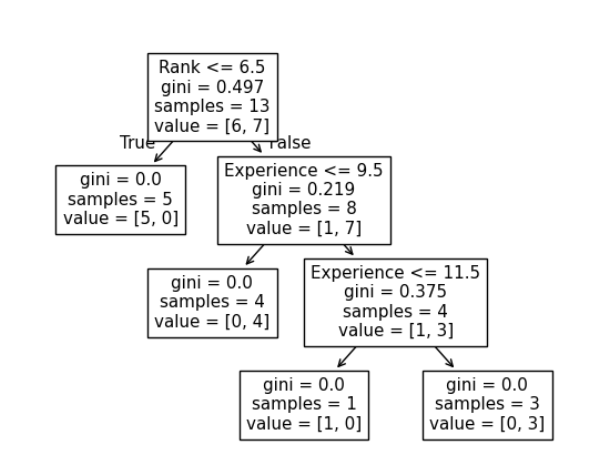
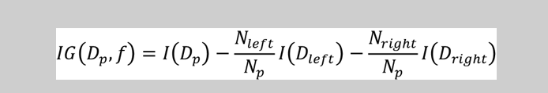
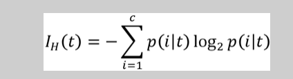
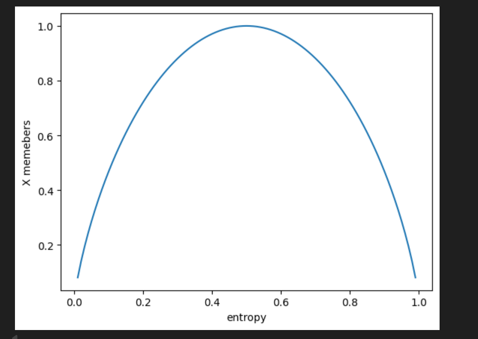
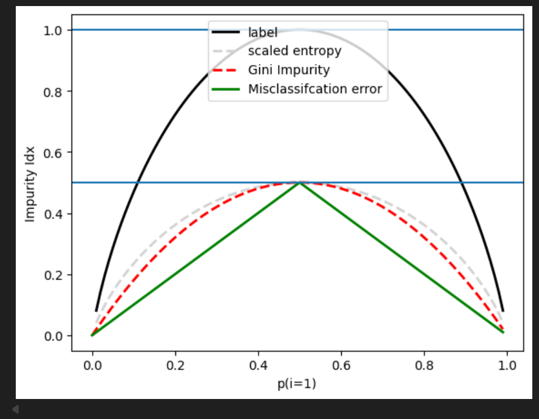
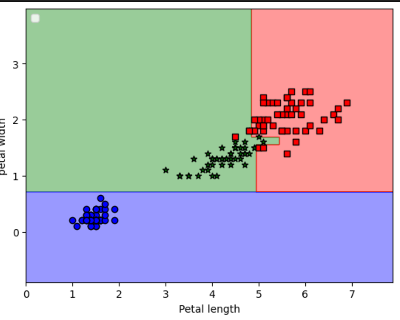
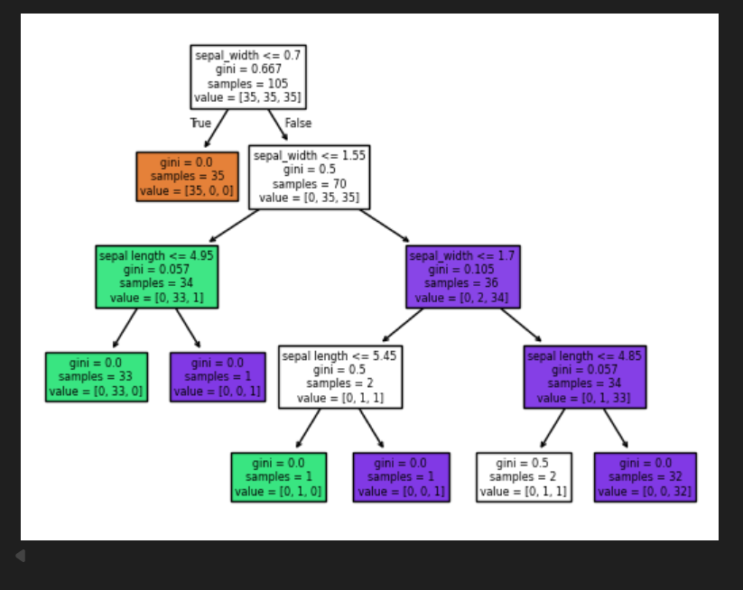

# Decision-Trees
tHE 1ST fILE has simple code for Decision trees

effects of entropy on different classes: 

# Different types of imputity

Visualizing different classes using decision tree: 

# Tree Logic
First check: If sepal width ≤ 0.7 → probably Setosa

If not, check: If sepal width ≤ 1.55

If yes → go to step 3

If no → Virginica 

Check sepal length:

If ≤ 4.95 →  Versicolor

If > 6.85 →  Virginica

Real-world applications:

Medical diagnosis (symptoms → disease)

Loan approval (income, credit score → approve/deny)

Spam filtering (email features → spam/not spam)